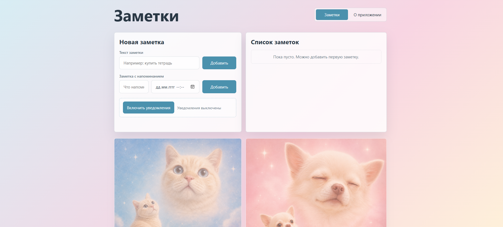

# Заметки

Контрольная работа №3: приложение для заметок по практикам 13-18.



## Как запустить

```bash
npm install
```

```bash
node server.js
```

Адрес:
```text
http://localhost:3001
```

HTTPS-адрес:

```text
https://localhost:3443
```


## Что сделано

- Практика 13: заметки добавляются на странице и сохраняются в браузере через `localStorage`. Также подключен Service Worker для офлайн-работы.
- Практика 14: добавлен `manifest.json`, meta-теги для PWA и иконки разных размеров.
- Практика 15: сделана оболочка приложения App Shell. Основной экран и страница “О приложении” лежат отдельно в `client/content/` и подгружаются без полной перезагрузки страницы.
- Практика 16: добавлен сервер на Express. Через Socket.IO заметка, созданная в одной вкладке, появляется в другой вкладке в реальном времени. Также есть push-подписка.
- Практика 17: можно создать заметку с датой и временем напоминания. Сервер ставит таймер, а в уведомлении есть действие “Отложить на 5 минут”.

